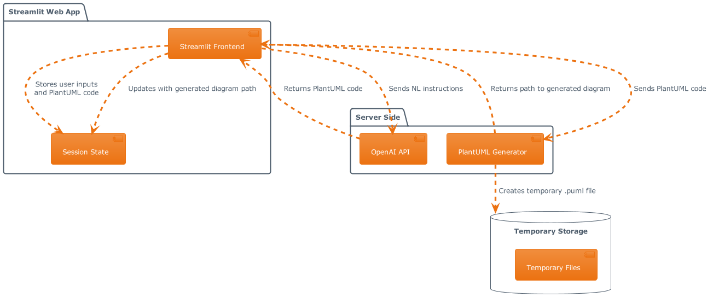

# Agent Peter - Diagram Generator

Agent Peter is a web-based application built with Streamlit that leverages the power of OpenAI's GPT-4 to convert natural language instructions into PlantUML code, which is then used to generate UML diagrams. This tool is designed to help users quickly create diagrams from their ideas without the need to write PlantUML code manually.

## Features

- **Natural Language Processing**: Describe your diagram requirements in plain English and let the AI convert it to PlantUML code.
- **PlantUML Code Generation**: Automatically generates PlantUML code from the given instructions.
- **Custom Code Editing**: Edit the generated PlantUML code to fine-tune your diagram.
- **Real-Time Diagram Preview**: View the UML diagram that corresponds to your PlantUML code in real-time.
- **Diagram Download**: Download the generated UML diagram as a PNG image for use in documentation or presentations.

## How to Use

1. **Enter Instructions**: In the text area provided, describe your requirements for the UML diagram in natural language. For example, "Help me create an instruction on how to bake a brownie."

2. **Generate Code**: Click the 'Convert to PlantUML' button to have the AI convert your instructions into PlantUML code. If an error occurs, try pressing the button again.

3. **Edit Code (Optional)**: If necessary, you can edit the generated PlantUML code directly in the text area that appears below the button.

4. **Download Diagram**: Once the code is finalized, the application will automatically generate and display the UML diagram. You can then download the diagram using the 'Download image' button.

## Output Example

Below is an example of a UML diagram generated by Agent Peter:

## Setup

To run Agent Peter locally, you will need:

- Java Runtime Environment (JRE) installed on your machine to run the PlantUML .jar file.
- The PlantUML .jar file placed in the root of your repository or specified location.
- An OpenAI API key with access to GPT-4 models.

## Troubleshooting

If you encounter any issues while using the application:

- Ensure that your OpenAI API key is correctly set up within the Streamlit secrets.
- Check that the PlantUML .jar file path is correctly specified in the application.
- If any errors occur during diagram generation, try regenerating the code or editing the PlantUML code manually.

## Contributions

Contributions to Agent Peter are welcome! If you have suggestions for improvements or bug fixes, please feel free to create an issue or pull request on the repository.

## License

This project is licensed under the MIT License. See the [LICENSE](LICENSE) file for details.

Thank you for using Agent Peter - happy diagramming!